# nefarious

**nefarious is a web application that automatically downloads Movies and TV Shows.**

It aims to combine features of [Sonarr](https://github.com/Sonarr/Sonarr/) and [Radarr](https://github.com/Radarr/Radarr).

It uses [Jackett](https://github.com/Jackett/Jackett/) and [Transmission](https://transmissionbt.com/) under the hood.  Jackett searches for torrents and Transmission does the downloading.

Features:
- [x] Search TV & Movies
- [x] Auto download TV (individual episodes or full seasons)
- [x] Auto download Movies
- [x] Discover TV & Movies (by popularity, genres, year etc)
- [x] Find similar TV & Movies
- [x] Find recommended TV & Movies
- [x] Manually search and download Jackett's torrent results
- [x] Supports blacklisting torrent results (i.e permanently avoid a bad/fake torrent)
- [X] Supports quality profiles (i.e only download *1080p* Movies and *720p* TV)
- [x] Supports whether to download media with hardcoded subtitles or not
- [x] Supports user defined keywords to filter results (i.e ignore "x265", "hevc" codecs)
- [x] Auto download TV & Movies once it's released (routinely scans for newly released content)
- [x] Monitor transmission results & status from within the app
- [x] Self/auto updating application so you're always up-to-date
- [x] Supports multiple users and permission groups (i.e admin users and regular users)
- [x] Responsive Design (looks great on desktops, tablets and small devices like phones)
- [x] Movie trailers
- [x] Automatically renames media
- [x] Supports multiple languages (TMDB supports internationalized Titles, Descriptions and Poster artwork)
- [x] Webhook support (i.e can post to Slack, Telegram etc when media downloads)
- [x] Imports existing libraries
- [x] VPN integration (optional)

### Contents

- [Demo](#demo)
- [Screenshots](#screenshots)
- [Dependencies](#dependencies)
- [Setup](#setup)
- [Usage](#usage)
- [Upgrading](#upgrading)
- [Troubleshooting](#troubleshooting)
- [Development](#development)

### Demo

### Screenshots

#### Login
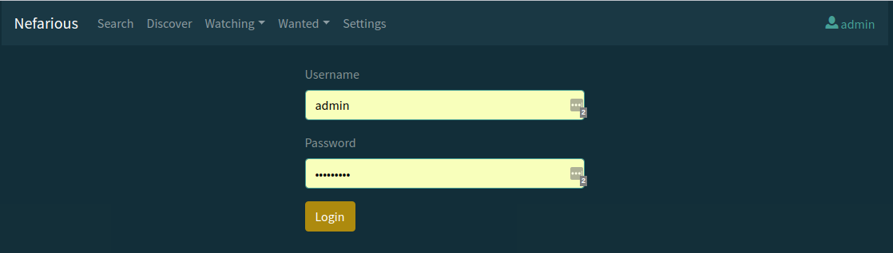
#### Search
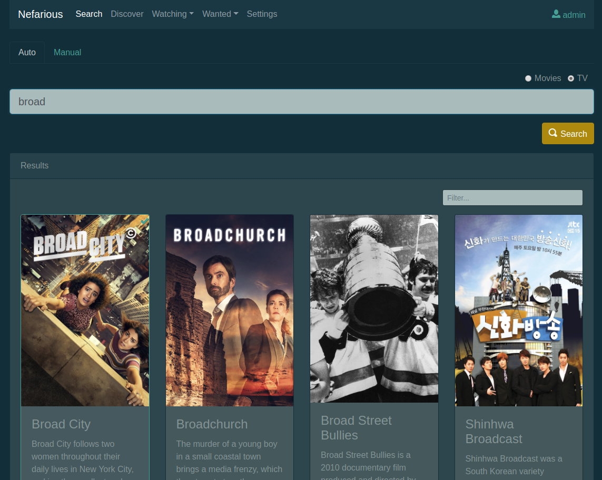
#### TV Result
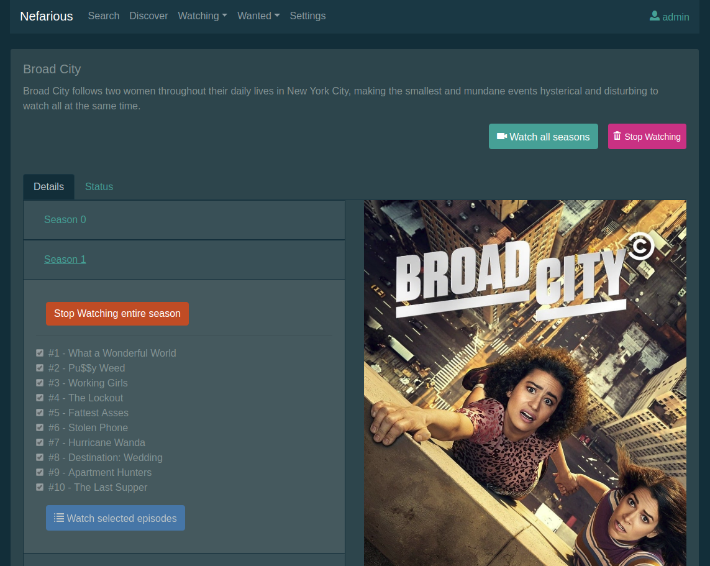
#### Movie Result
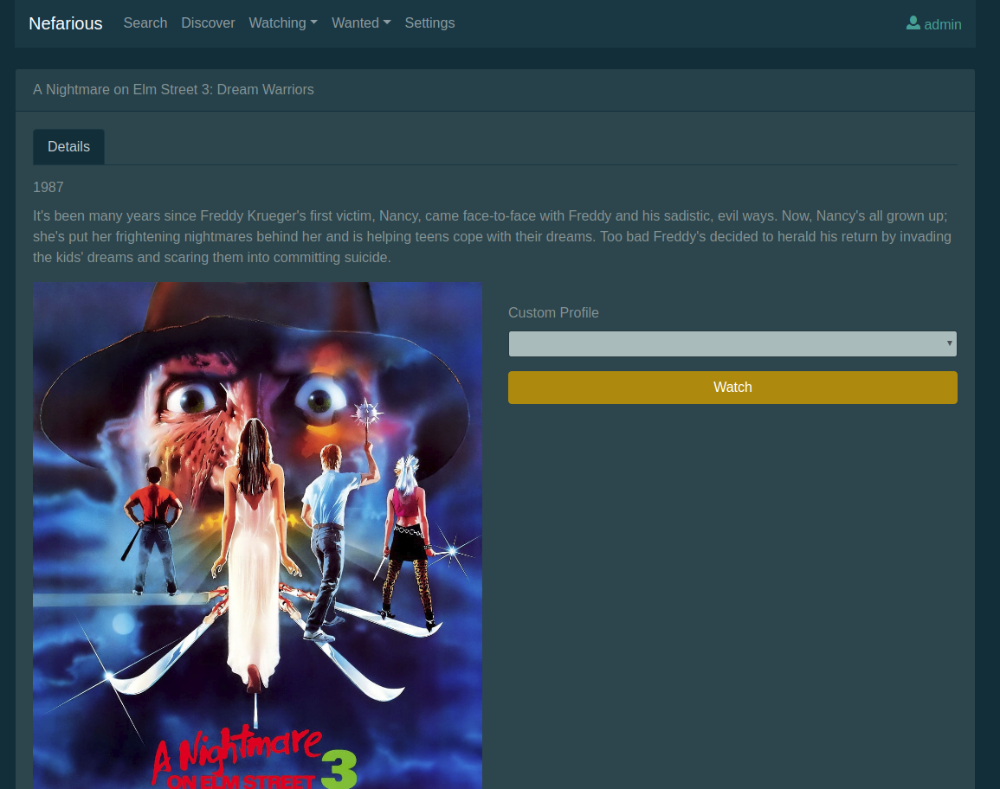
#### Movie Custom Quality Profile
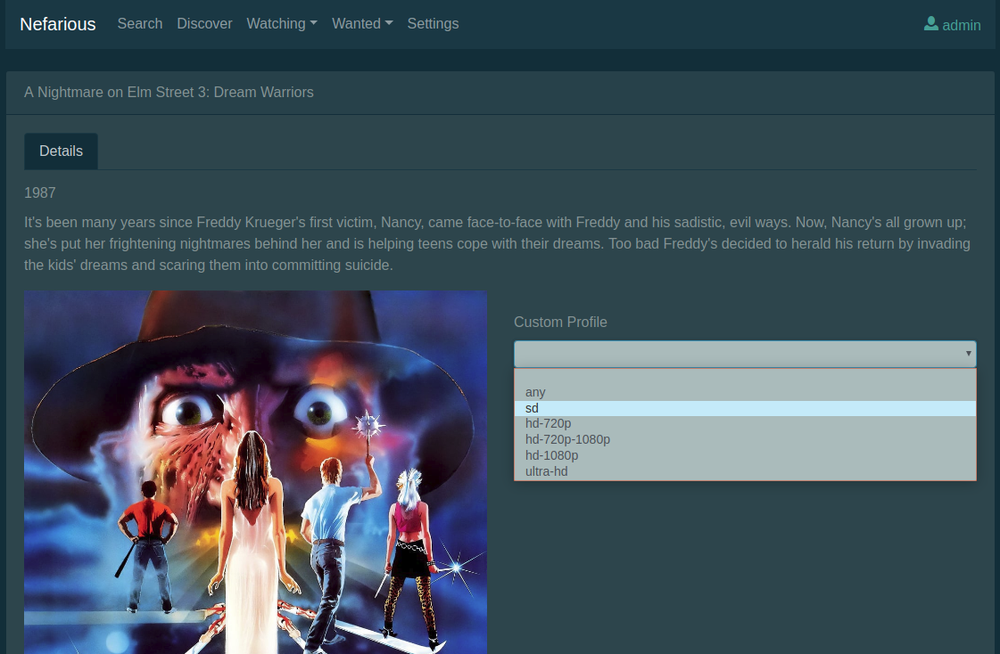
#### Download Status
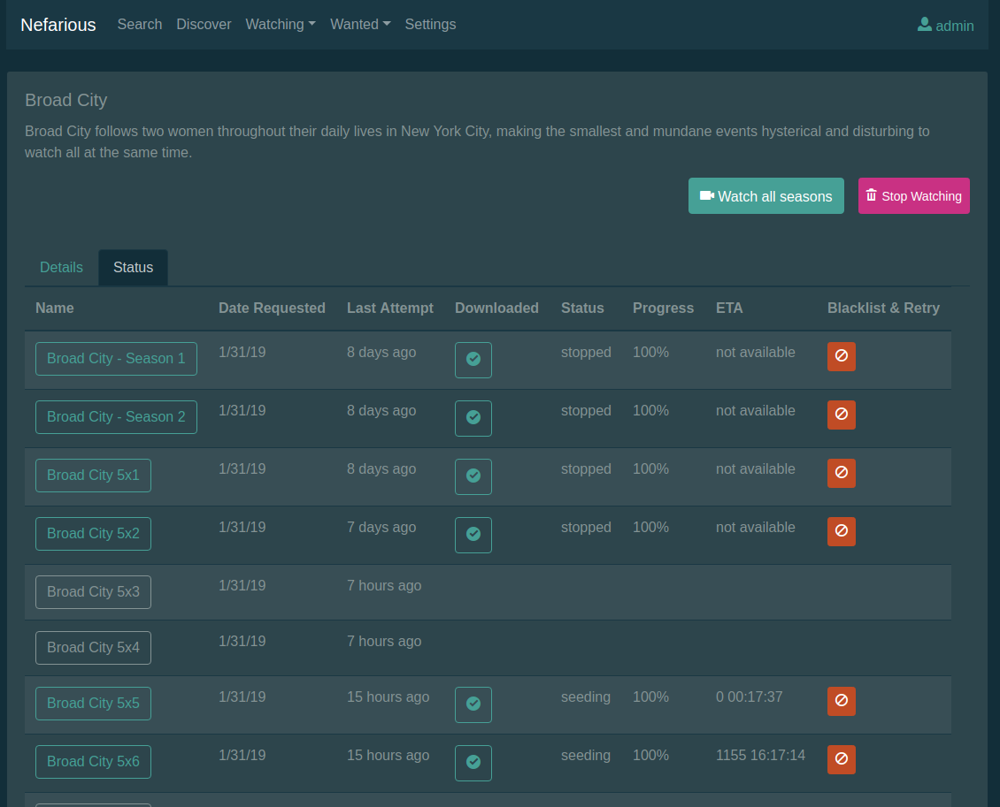
#### Discover
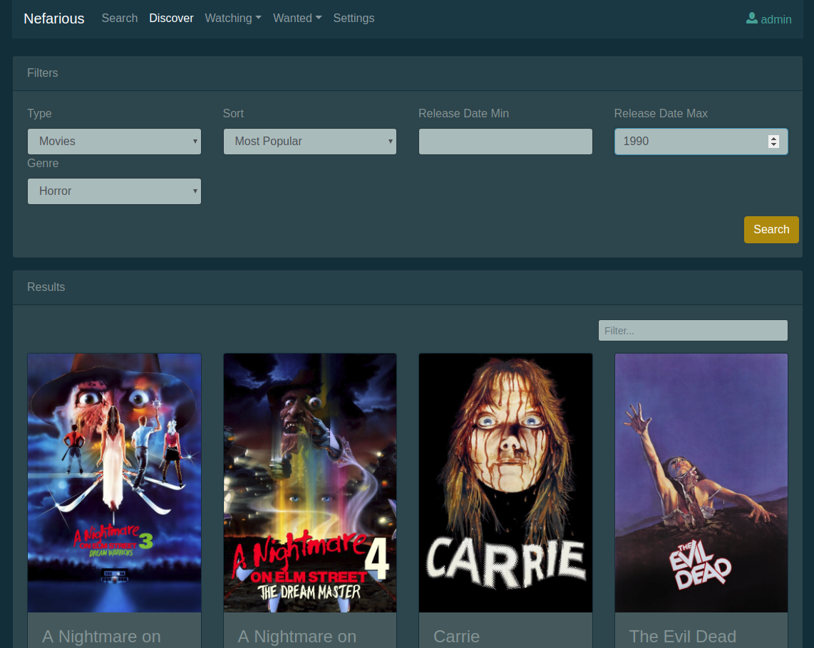
#### Wanted
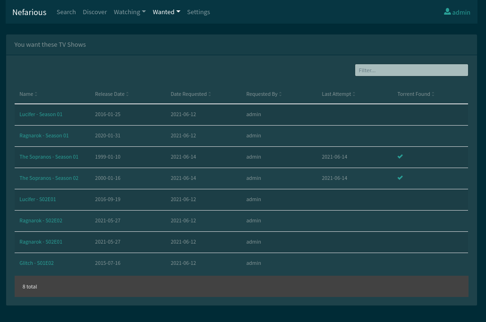
#### Watching
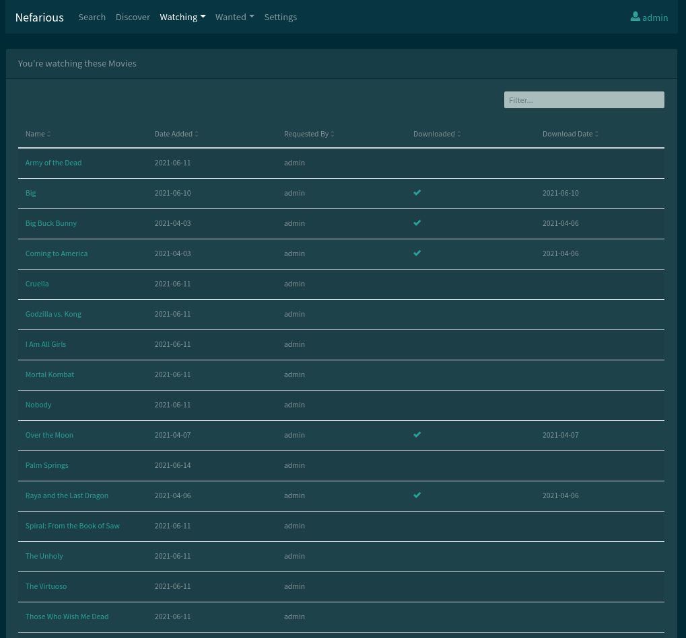
#### Settings
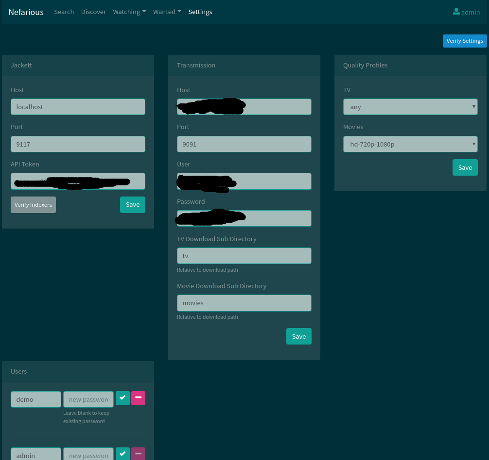
#### Search Manual
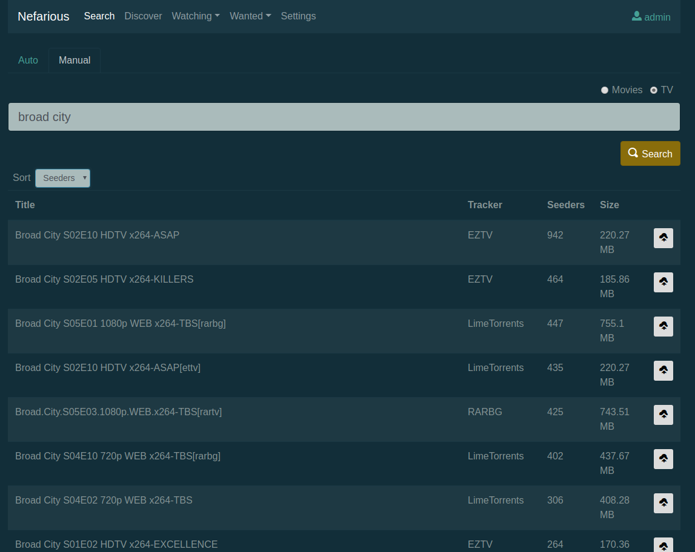
#### Mobile Friendly
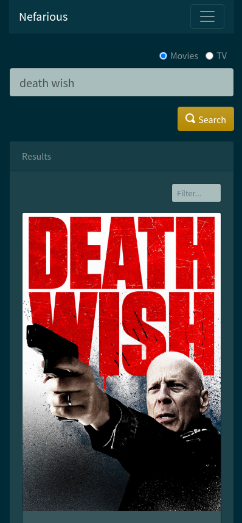

### Dependencies

See [DEPENDENCIES.md](docs/DEPENDENCIES.md)

### Setup

You must have **docker** and **docker-compose** already installed.  See [dependencies](docs/DEPENDENCIES.md).

#### Part 1
    
Clone the nefarious repository:

    git clone https://github.com/lardbit/nefarious.git
    cd nefarious
    
Copy the default environment file to make changes:

    cp env.template .env
    
Edit `.env` as needed for your settings, at least defining *HOST_DOWNLOAD_PATH* to something like *HOST_DOWNLOAD_PATH=/path/to/downloads*.
    
Start all the containers:

    docker-compose up -d
    
**NOTE: the first time you start nefarious can take a few minutes.**

Your default local URLs for all the various services will be:

- nefarious: [http://localhost:8000](http://localhost:8000)
- Jackett: [http://localhost:9117](http://localhost:9117)
- Transmission: [http://localhost:9091](http://localhost:9091)

**See** [Part 2](#part-2) for finalizing the configuration.

##### ARM devices

See [ARM.md](docs/ARM.md) for arm-based architectures like the raspberry pi, odroid, pine etc. 

##### VPN

See [VPN.md](docs/VPN.md) for VPN integration.

#### Part 2

The default nefarious user/password is `admin`/`admin`.  On first login you will be directed to the main nefarious settings and asked to configure your Jackett API token.
Jackett's **host** in the main settings should remain `jackett` and the port should remain `9117`.  Copy your API Token from [Jackett](http://localhost:9117) into the appropriate nefarious section.
Don't forget to also add some indexers in Jackett to track your preferred content, and be sure to test them to see that they're working.  Some popular examples are *The Pirate Bay*, *1337x*, *RARBG*.

Transmission's host should remain `transmission` and port should remain `9091`.  It's possible to configure it with a username and password, but defaults to keeping them both blank.
Entering both username and password in the nefarious settings should only be done if the Transmission settings of 'transmission-settings.json' were also configured for your desired user/pass.
The Download Subdirectories can also be configured here as well.  Bear in mind these are subdirectories, and that we will be configuring the parent download directory shortly.
Leaving these as they are will be perfectly fine.  

*Global Language*, *Keyword Exclusions*, *Subtitles*, and *Quality Profiles* can also be configured here.
TV and Movie quality profiles can be changed independently of each other if you wish to have differing profiles.
User accounts and passwords can be added or modified as well.
Once all of your settings are updated, click `Save` then be sure to `Verify Settings` to make sure they're valid.

##### Transmission Configuration

There is no default transmission user/pass, but feel free to edit the `transmission-settings.json` beforehand following the [official settings](https://github.com/transmission/transmission/wiki/Editing-Configuration-Files) to make any changes you'd like.

**NOTE** if you make any changes to `transmission-settings.json` you'll have to recreate the transmission container for the changes to take place:

    docker-compose up -d --force-recreate transmission
    
### Usage

See [USAGE.md](docs/USAGE.md).

### Upgrading

If you're running nefarious via the default `docker-compose.yml` file then nefarious will automatically update to the newest versions as they release.
However, occasionally the `docker-compose.yml` configuration file changes and you'll need to redo the steps in [Setup](#setup).
*You will not lose your nefarious settings due to persistent docker volumes.  It's a safe operation.*

### Troubleshooting

See [TROUBLESHOOTING.md](docs/TROUBLESHOOTING.md).

### Development

See [DEVELOPMENT.md](docs/DEVELOPMENT.md).
